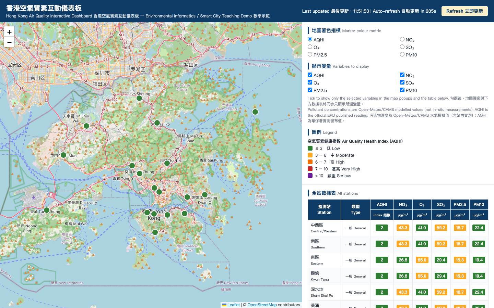

# Hong Kong Air Quality Interactive Dashboard (MIS Teaching Demo)

**Live demo (GitHub Pages): https://drhycheung.github.io/EnvInfo/**



A single-file, front-end-only interactive dashboard for visualising Hong Kong's real-time air
quality across all **18 EPD monitoring stations** (15 general + 3 roadside). Built for classroom
demonstration in **Environmental Informatics** and **Smart City** courses.

File: `index.html` — no build step, no backend, no API key. Open it in a
browser and it works; drop it into a GitHub Pages repository and it is deployed.

---

## 1. What the dashboard does

| Feature | Implementation |
|---|---|
| Interactive map of all 18 stations | Leaflet.js (CDN) + OpenStreetMap tiles |
| Markers coloured by pollutant level | Simple 5-band graded colour scale, switchable per variable |
| Click popups | Station name (EN/中文), type, address, selected readings with units/bands, data timestamps |
| Variable selection | Checkboxes for AQHI, NO₂, O₃, SO₂, PM2.5, PM10 — map popups, markers and the data table update in sync |
| Colour metric | Radio buttons choose which variable drives marker colours |
| Data table | All 18 stations × selected variables, colour-coded cells |
| Bilingual interface | Every piece of on-screen text is presented in both Traditional Chinese and English |
| Auto-refresh | Polls every **300 seconds**; preserves checkbox state and never resets the map view |
| Error handling | On-page banner if either data source fails; last successful data is retained |
| Attribution | EPD/data.gov.hk source statement, Open-Meteo CC BY 4.0 credit, CAMS acknowledgement, OSM/Leaflet credits |

## 2. Data sources (and why two of them)

A key lesson of this project is that **the "obvious" official API cannot be used from a browser**:

| Source | Data provided | CORS policy | Browser? |
|---|---|---|---|
| EPD AQHI JSON | Official AQHI + health risk + publish time, all 18 stations, hourly | Open (`*`) | ✅ |
| Open-Meteo air quality | NO₂, O₃, SO₂, PM2.5, PM10 (CAMS model) at any lat/lon; batchable | Open (`*`), keyless | ✅ |
| EPD pollutant XML | Official station readings, past 24 h | Locked to aqhi.gov.hk | ❌ |
| City Dashboard map feed (POST) | Official readings **plus coordinates** | None sent | ❌ |

Full endpoint URLs:

```text
✅ https://dashboard.data.gov.hk/api/aqhi-individual?format=json
✅ https://air-quality-api.open-meteo.com/v1/air-quality
❌ https://www.aqhi.gov.hk/epd/ddata/html/out/24pc_Eng.xml
❌ https://dashboard.data.gov.hk/dashboard/smart_environment/data/map   (POST only)
```

So the dashboard fuses:

1. **EPD AQHI JSON** → official AQHI + health risk per station (join key: exact English station name).
2. **Open-Meteo air-quality API** → modelled pollutant concentrations at each station's hardcoded
   coordinates (all 18 stations fetched in **one batched request** by comma-separating coordinates).
   These are CAMS model values, clearly labelled "模擬" in the UI — *not* analyser readings.
3. **Hardcoded station metadata** — the 18 station names must match the API strings exactly
   (`Central/Western`, `Southern`, … `Mong Kok`). Coordinates come from the City Dashboard's
   published station addresses and the July 2020 government press release for the two newest
   stations (Southern = Aberdeen Tennis & Squash Centre; North = Po Wing Road Sports Centre).

> Teaching point: this is real-world spatial data fusion — real-time observations joined to static
> geometry metadata by name as primary key — plus an honest discussion of measurement vs model data.

## 3. How to run

- **Locally**: double-click `index.html` (any modern browser), or serve it:
  `python3 -m http.server 8000` then visit `http://localhost:8000/index.html`.
- **GitHub Pages (your own deployment)**: push `index.html` to *your* GitHub repository, then enable
  Pages via **Settings → Pages → Deploy from a branch** (select the branch and `/ (root)`). Your
  dashboard will go live at `https://<your-username>.github.io/<repo-name>/` — replace the
  placeholders with your own GitHub username and repository name.
  (The live-demo link at the top of this README is the author's own deployment.)

Desktop browsers assumed (no mobile optimisation, by design).

## 4. How this was built with OpenCode

The dashboard was produced in one OpenCode session using an agentic verify-first workflow:

1. **Endpoint discovery & verification** — OpenCode searched data.gov.hk, then used `curl` to fetch
   each candidate API, inspect headers (`access-control-allow-origin`) and JSON/XML structure.
   This exposed the CORS wall on the official XML and found the CORS-open AQHI endpoint.
2. **Fallback sourcing** — when no keyless CORS-open source of official pollutant readings existed,
   OpenCode verified Open-Meteo (keyless, `CORS *`, batch mode) against live HK coordinates.
3. **Geocoding the stations** — official coordinates for 16 stations were recovered from the City
   Dashboard's ArcGIS map feed; the two 2020 stations were located via the gov.hk press release and
   geocoded through Nominatim/Overpass (OpenStreetMap).
4. **Code generation** — a single annotated HTML file (native ES6, Chinese comments per block).
5. **Browser testing** — OpenCode drove the page with Playwright: checked console errors, confirmed
   18 table rows × 6 variables rendered, opened a popup, toggled checkboxes (table columns and
   popup content updated), switched the colour metric (markers recoloured, legend updated).

Total elapsed time: roughly one working session, most of it spent on steps 1–3 — which is exactly
why those findings are baked into the student prompt below.

## 5. Design Thinking: from raw data to an intuitive dashboard

The dashboard is the output of one design-thinking loop applied to a real usability problem:
Hong Kong's air quality data exist, but they are not intuitive.

| Stage | This project's arc |
|---|---|
| **1. Empathise 同理心** | The user pain: pollutant tables buried on official sites, technical units (μg/m³), AQHI split from pollutant detail, sources scattered across pages, little geographic context. Non-experts cannot quickly answer "is the air bad near me right now?" |
| **2. Define 定義** | Problem statement: *air quality information is available but not intuitive — residents need a single view that makes monitoring effortless and comparison instant.* Design goal: one screen, minimal jargon, at-a-glance status |
| **3. Ideate 構思** | Options to make data intuitive: colour-coded map markers (read status without reading numbers), graded legends instead of raw thresholds, health-risk wording alongside indices, click-for-detail popups, a full-data table, bilingual labels. Converged design: interactive Leaflet map + control panel + summary table |
| **4. Prototype 原型** | The single-file dashboard itself: every ideation choice materialised — green-to-purple marker colours, popups on demand, checkboxes to reduce clutter, 300-second auto-refresh so the page "monitors" without user effort |
| **5. Test 測試** | Browser-automated checks plus real-user feedback; each fine-tuning round improved intuitiveness — wider panel, fully bilingual text, clearer table spacing, an explicit modelled-vs-measured disclaimer |

Intuition was treated as the measurable outcome: every design decision traces back to reducing
the time from "open page" to "understood the air".

**Benchmark against the official service**: EPD operates its own air quality website at
[www.aqhi.gov.hk](https://www.aqhi.gov.hk). Its pollutant figures are **more accurate** —
direct measurements from the monitoring stations rather than modelled values — and remain the
authoritative reference. This project complements rather than replaces it: the focus here is on
intuitive at-a-glance visualisation, with data provenance labelled honestly and users pointed
back to EPD for authoritative readings.

> [!TIP]
> In this sense, the project is **not unique** — official and third-party air quality dashboards
> already exist. That is by design: it is a teaching baseline, not a novel product. Students are
> encouraged to explore extensions of this project, or similar projects of their own — new data
> layers, analyses, audiences or services — so that what they build brings genuinely unique value
> to environmental management.

## 6. Student reproduction prompt

Give the prompt below to Gemini, OpenCode, Claude, ChatGPT or any coding agent. It encodes every
pitfall discovered above, so a working dashboard should come out first-pass:

```text
Build a complete, standalone, single-file HTML page (all CSS/JS inline, native ES6 only,
no frameworks) for a Hong Kong air quality dashboard, deployable on GitHub Pages.

DATA SOURCES — use exactly these, they are verified working:
1. AQHI (official EPD, CORS-open):
   https://dashboard.data.gov.hk/api/aqhi-individual?format=json
   Returns an array: {station:"Central/Western", aqhi:2, health_risk:"Low",
   publish_date:"2026-08-21T09:30:00"} for 18 stations.
2. Pollutant concentrations NO2/O3/SO2/PM2.5/PM10 (Open-Meteo, keyless, CORS-open):
   https://air-quality-api.open-meteo.com/v1/air-quality
     ?latitude=<lat1,lat2,...>&longitude=<lon1,lon2,...>
     &current=pm10,pm2_5,nitrogen_dioxide,ozone,sulphur_dioxide&timezone=Asia/Hong_Kong
   Comma-separate ALL 18 station coordinates so ONE request returns an array covering
   every station (response order matches input order).
DO NOT use www.aqhi.gov.hk XML feeds or dashboard.data.gov.hk POST endpoints:
they lack CORS headers and will fail from a browser.

STATIONS: hardcode an array of all 18 stations with fields
{name, zh, type:'general'|'roadside', lat, lon}. The name string MUST exactly equal the
API's station field (it is the join key): Central/Western, Southern, Eastern, Kwun Tong,
Sham Shui Po, Kwai Chung, Tsuen Wan, Tseung Kwan O, Yuen Long, Tuen Mun, Tung Chung,
Tai Po, Sha Tin, North, Tap Mun, Causeway Bay, Central, Mong Kok.
Use plausible central coordinates for each district (general stations are rooftop sites,
roadside stations are at street level in Causeway Bay, Central and Mong Kok).

REQUIREMENTS:
- Leaflet.js via CDN, OpenStreetMap tiles; one circle-marker per station whose fill colour
  follows a simple 5-band graded scale of the currently selected colour metric (radio group,
  default AQHI); clicking a marker opens a popup showing the CHECKED variables with units,
  band label and both data timestamps.
- Checkbox list (AQHI, NO2, O3, SO2, PM2.5, PM10, all checked initially): checking/unchecking
  updates markers' popups AND the data table simultaneously.
- Right sidebar: colour-metric radios, variable checkboxes, dynamic legend, and a data table
  listing all 18 stations x checked variables with colour-coded cells.
- Auto-poll both APIs every 300 seconds WITHOUT resetting checkbox state or the map view
  (update markers in place with setStyle/setPopupContent; never re-create the map).
- Show a red error banner if either request fails and keep the last good data.
- Label AQHI values as "EPD official" and pollutant values as "modelled (CAMS)".
- Include an attribution footer crediting: EPD via DATA.GOV.HK; Air quality data by
  Open-Meteo.com under CC BY 4.0 (underlying data Copernicus CAMS/ECMWF);
  © OpenStreetMap contributors; Leaflet.
- Add generous Chinese comments explaining each functional block (teaching use).
```

## 7. Licences & attribution

- AQHI data: Environmental Protection Department, HKSAR Government, via [DATA.GOV.HK](https://data.gov.hk).
- Pollutant concentration layer: [Air quality data by Open-Meteo.com](https://open-meteo.com/),
  licensed [CC BY 4.0](https://creativecommons.org/licenses/by/4.0/); underlying data from the
  Copernicus Atmosphere Monitoring Service (CAMS), ECMWF.
- Basemap: © [OpenStreetMap contributors](https://www.openstreetmap.org/copyright); map library: [Leaflet](https://leafletjs.com).
